# P5.3 - Informe RA3 sobre el despliegue (WildFly contenedor + Gradle)

## Autor
- **Nombre:** acasmor0802
- **Fecha:** 11 de febrero de 2026

---

## a) Componentes y funcionamiento de los servicios del servidor

### Componentes del despliegue

| Componente | Descripción |
|---|---|
| **Docker** | Plataforma de contenedores que encapsula WildFly y sus dependencias en un entorno aislado y reproducible. |
| **WildFly 39.0.0** | Servidor de aplicaciones Jakarta EE. Ejecuta la aplicación WAR y gestiona el ciclo de vida de los servicios REST. |
| **Aplicación WAR (crud-file.war)** | Artefacto web generado con Gradle. Contiene la API REST (CRUD de tareas) y un frontend HTML/JS. |
| **Puerto 8080** | Puerto HTTP de WildFly por donde se sirve la aplicación al exterior. |
| **Puerto 9990** | Puerto de administración de WildFly (consola de gestión web y CLI). |
| **Endpoint REST /api/tasks** | Recurso JAX-RS (Jakarta RESTful Web Services) que expone operaciones CRUD sobre tareas. |
| **Nginx** | Servidor web frontal que actúa como reverse proxy, redirigiendo las peticiones a WildFly y gestionando TLS/HTTPS. |

### Flujo de una petición

El flujo que sigue una petición desde el cliente hasta obtener la respuesta es el siguiente:

1. El **cliente** (navegador o curl) envía una petición HTTP/HTTPS.
2. **Nginx** (puertos 80/443) recibe la petición y actúa como reverse proxy, terminando TLS si es HTTPS.
3. Nginx reenvía la petición internamente a **WildFly** (puerto 8080 dentro de la red Docker) usando `proxy_pass`.
4. **Undertow** (el contenedor web de WildFly) recibe la petición HTTP.
5. Busca la aplicación que corresponde según el contexto de la URL (`/crud-file`).
6. Despacha la petición a la clase `TasksApplication` (anotada con `@ApplicationPath("/api")`).
7. `TaskResource` (anotado con `@Path("/tasks")`) procesa la petición según el método HTTP (GET, POST, PUT, DELETE).
8. `FileTaskStore` lee o escribe en el fichero JSON de datos.
9. Se devuelve la **respuesta JSON** al cliente a través de la misma cadena.

### Evidencias

**docker ps mostrando el contenedor y los puertos publicados:**

> Captura: ejecutar `docker compose ps` en la terminal.

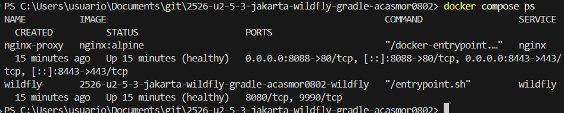

**docker logs mostrando el despliegue:**

> Captura: ejecutar `docker logs wildfly --tail 20` en la terminal.

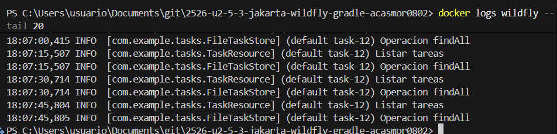

**Respuesta del endpoint (curl/PowerShell):**

> Captura: ejecutar en PowerShell:
> `Invoke-RestMethod -Uri "http://localhost:8088/api/tasks" -Method GET | ConvertTo-Json`

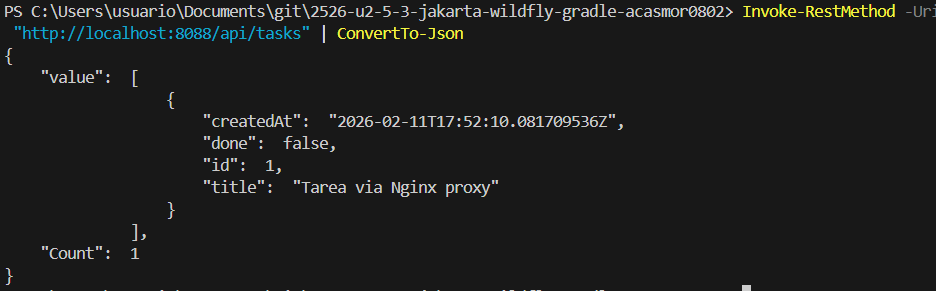

---

## b) Archivos principales de configuración y bibliotecas compartidas

### Archivos de configuración de WildFly

La configuración principal de WildFly reside dentro del contenedor en:

```
/opt/jboss/wildfly/standalone/configuration/
```

**Listado del directorio de configuración:**

> Captura: ejecutar `docker exec wildfly ls /opt/jboss/wildfly/standalone/configuration/` en la terminal.

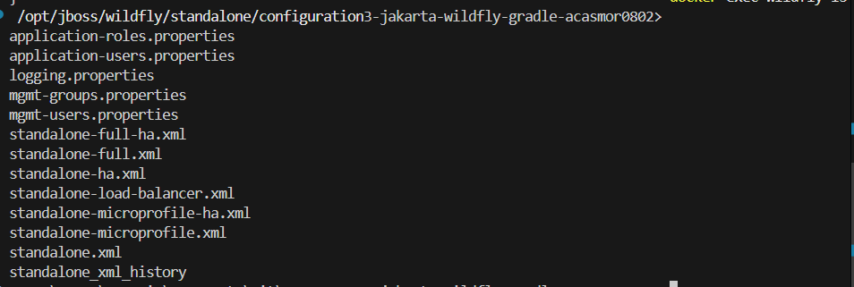

| Archivo | Función |
|---|---|
| **standalone.xml** | Archivo maestro. Gobierna todo el servidor en modo standalone: datasources, seguridad, logging, subsistema web (Undertow), puertos, etc. |
| **mgmt-users.properties** | Usuarios de gestión (consola 9990). |
| **mgmt-groups.properties** | Grupos/roles de los usuarios de gestión. |
| **application-users.properties** | Usuarios de aplicación. |
| **logging.properties** | Configuración del sistema de logging antes de que arranque el subsistema de log completo. |

### Ajustes que se podrían tocar en standalone.xml

- **Datasources**: Configurar conexiones a bases de datos (MySQL, PostgreSQL).
- **Logging**: Cambiar nivel de log (DEBUG, INFO, WARN) y fichero de salida.
- **Undertow (subsistema web)**: Cambiar puertos, tamaño máximo de subida, configuración HTTP/2.
- **Security (Elytron)**: Configurar dominios de seguridad, LDAP, certificados.
- **JMS/Messaging**: Configurar colas de mensajería.

### Dependencias "provided" (compileOnly)

En el `build.gradle`:

```groovy
dependencies {
    compileOnly 'jakarta.platform:jakarta.jakartaee-api:10.0.0'
}
```

La dependencia `jakarta.jakartaee-api` se marca como `compileOnly` (equivalente a `provided` en Maven). Esto significa que:

- **Se usa en compilación** para que el código compile correctamente (imports de `jakarta.ws.rs.*`, `jakarta.json.bind.*`, etc.).
- **NO se incluye en el WAR** porque WildFly ya proporciona estas bibliotecas como parte del servidor.
- **Ventaja**: El WAR es más ligero (~13KB en lugar de varios MB) y se evitan conflictos de versiones entre las librerías del servidor y las de la aplicación.

---

## c) Cooperación con el servidor web (proxy / reverse proxy) y HTTPS

### Configuración de reverse proxy con Nginx

En el despliegue directo de P5.2, el cliente accedía directamente a WildFly por `localhost:8080`. En un entorno real, se coloca **Nginx** como servidor web frontal:

**Fragmento de `nginx.conf`:**

```nginx
worker_processes auto;

events {
    worker_connections 1024;
}

http {
    # Servidor HTTP
    server {
        listen 80;
        server_name localhost;

        location /api/ {
            proxy_pass http://wildfly:8080/crud-file/api/;
            proxy_set_header Host $host;
            proxy_set_header X-Real-IP $remote_addr;
            proxy_set_header X-Forwarded-For $proxy_add_x_forwarded_for;
            proxy_set_header X-Forwarded-Proto $scheme;
        }

        location / {
            proxy_pass http://wildfly:8080/crud-file/;
            proxy_set_header Host $host;
            proxy_set_header X-Real-IP $remote_addr;
            proxy_set_header X-Forwarded-For $proxy_add_x_forwarded_for;
            proxy_set_header X-Forwarded-Proto $scheme;
        }
    }

    # Servidor HTTPS con TLS
    server {
        listen 443 ssl;
        server_name localhost;

        ssl_certificate     /etc/nginx/certs/server.crt;
        ssl_certificate_key /etc/nginx/certs/server.key;
        ssl_protocols       TLSv1.2 TLSv1.3;
        ssl_ciphers         HIGH:!aNULL:!MD5;

        location /api/ {
            proxy_pass http://wildfly:8080/crud-file/api/;
            proxy_set_header Host $host;
            proxy_set_header X-Real-IP $remote_addr;
            proxy_set_header X-Forwarded-For $proxy_add_x_forwarded_for;
            proxy_set_header X-Forwarded-Proto $scheme;
        }

        location / {
            proxy_pass http://wildfly:8080/crud-file/;
            proxy_set_header Host $host;
            proxy_set_header X-Real-IP $remote_addr;
            proxy_set_header X-Forwarded-For $proxy_add_x_forwarded_for;
            proxy_set_header X-Forwarded-Proto $scheme;
        }
    }
}
```

### Qué cambia respecto al despliegue directo de P5.2

| Aspecto | P5.2 (directo) | Con Nginx (proxy) |
|---|---|---|
| **URL del cliente** | `http://localhost:8080/crud-file/api/tasks` | `https://localhost/api/tasks` |
| **Puertos expuestos al host** | 8080 y 9990 | Solo 80 y 443 (Nginx) |
| **Puerto 9990** | Accesible desde fuera | **No expuesto** — solo visible dentro de la red Docker |
| **TLS/HTTPS** | No | Sí — Nginx termina SSL |
| **Ruta de la API** | `/crud-file/api/tasks` | `/api/tasks` (más limpia) |

### Configuración TLS

Los certificados se generaron con OpenSSL (autofirmados para desarrollo):

```bash
openssl req -x509 -nodes -days 365 \
  -newkey rsa:2048 \
  -keyout certs/server.key \
  -out certs/server.crt \
  -subj "/C=ES/ST=Cordoba/L=Cordoba/O=DAW/OU=Despliegue/CN=localhost"
```

**Ventajas de TLS:**
- **Cifrado**: Todo el tráfico entre cliente y servidor va cifrado (protege contra sniffing).
- **Integridad**: Se detecta cualquier modificación en los datos en tránsito.
- **Autenticación**: El certificado verifica la identidad del servidor.

**¿Cambia algo en WildFly o en la aplicación?** No. WildFly sigue sirviendo en HTTP plano (puerto 8080) internamente. El cifrado TLS se maneja exclusivamente en Nginx (TLS termination). La aplicación Java no necesita ningún cambio.

### Evidencias

**Docker compose con puertos publicados solo vía Nginx:**

```yaml
  wildfly:
    expose:
      - "8080"     # Solo visible dentro de la red Docker
      # 9990 NO se expone

  nginx:
    ports:
      - "8088:80"   # HTTP
      - "8443:443"  # HTTPS
```

**Prueba de acceso a través de Nginx:**

> Captura: ejecutar el POST a través de Nginx en PowerShell.

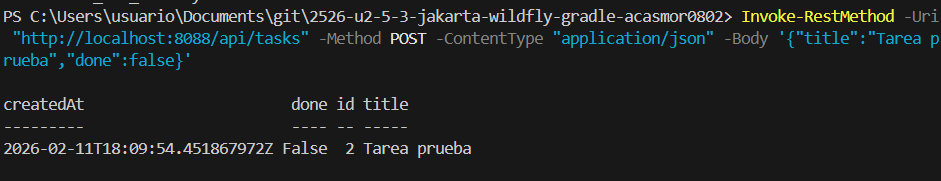

---

## d) Mecanismos de seguridad del servidor de aplicaciones

### Medidas aplicadas en P5.2

1. **Credenciales de administración**: Se creó un usuario de gestión con contraseña segura mediante `add-user.sh`.
2. **Puertos controlados**: Solo se expusieron los puertos necesarios (8080 para la app y 9990 para administración).

### Medidas adicionales para producción (mínimo 4)

#### 1. Protección de la consola de administración (9990)

**Problema**: En P5.2 se usó `-bmanagement 0.0.0.0` para abrir la consola a todas las interfaces.

**Solución**: En producción, **nunca exponer el puerto 9990 al exterior**. En docker-compose, usamos `expose` en lugar de `ports`:

```yaml
wildfly:
  expose:
    - "8080"
  # 9990 NO se expone — solo accesible desde la red interna Docker
```

La consola solo es accesible desde dentro de la red Docker o vía VPN/túnel SSH.

#### 2. Exposición mínima de puertos

**En P5.2**: `docker run -p 8080:8080 -p 9990:9990` — ambos puertos expuestos al host.

**En producción**: Solo se exponen los puertos de Nginx (80/443). WildFly y su consola quedan en una red interna.

> Captura: ejecutar `docker compose ps` mostrando que wildfly no tiene mapeo de puertos al host.


#### 3. Gestión de secretos

**Problema**: Las contraseñas no deben estar en el código fuente ni en el Dockerfile.

**Solución**: Usar Docker Secrets o variables de entorno inyectadas en tiempo de ejecución:

```yaml
# Ejemplo con Docker Secrets
secrets:
  wildfly_admin_pass:
    file: ./secrets/admin_password.txt

services:
  wildfly:
    secrets:
      - wildfly_admin_pass
```

El archivo `secrets/` se añade a `.gitignore` para que nunca llegue al repositorio.

#### 4. Registro y trazabilidad (logs)

**Problema**: Si el contenedor se destruye, los logs desaparecen.

**Solución**: Montar volúmenes para persistir los logs:

```yaml
volumes:
  - wildfly-logs:/opt/jboss/wildfly/standalone/log
  - nginx-logs:/var/log/nginx
```

**Evidencia de logs accesibles:**

> Captura: ejecutar `docker logs wildfly --tail 5` para ver los logs persistidos.

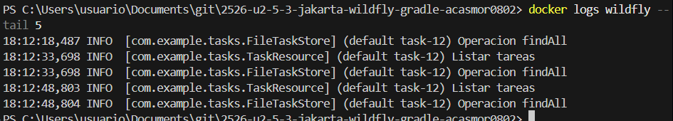

#### 5. Hardening del contenedor

- **No ejecutar como root en producción**: El entrypoint fija permisos como root y luego cambia al usuario `jboss`.
- **Limitar recursos**: `deploy.resources.limits` en docker-compose (CPU: 1.0, memoria: 512M).
- **Restart policy**: `restart: unless-stopped` para recuperación automática.

---

## e) Componentes web del servidor de aplicaciones

### ¿Qué es el WAR y qué contiene?

El WAR (Web Application Archive) es un archivo comprimido estándar de Jakarta EE que contiene todo lo necesario para desplegar una aplicación web. En nuestro caso, `crud-file.war` contiene:

- **WEB-INF/web.xml**: Descriptor de despliegue, define el welcome-file (index.html).
- **WEB-INF/classes/com/example/tasks/**: Las clases Java compiladas:
  - `TasksApplication.class`: Define `@ApplicationPath("/api")`.
  - `TaskResource.class`: Endpoints REST CRUD.
  - `Task.class`: Modelo de datos.
  - `TaskStore.class`: Interfaz del almacén.
  - `FileTaskStore.class`: Persistencia en fichero JSON.
- **index.html**: Frontend web (HTML + JS) que consume la API.

### Contexto de la aplicación (context-root)

El **contexto** es la primera parte de la URL que identifica a la aplicación dentro del servidor. WildFly lo determina por el nombre del archivo WAR:

- Archivo: `crud-file.war` → Contexto: `/crud-file`
- URL base: `http://localhost:8080/crud-file/`

### Contenedor web: Undertow

WildFly utiliza **Undertow** como motor web interno. Undertow:
- Escucha en el puerto 8080 (HTTP) y 8443 (HTTPS interno).
- Recibe las peticiones HTTP del cliente.
- Las despacha a la aplicación correcta según el contexto de la URL.
- WildFly inyecta el runtime de Jakarta RESTful Web Services (RESTEasy) para procesar las anotaciones JAX-RS.

### Desglose de URL real

Tomando como ejemplo la URL `http://localhost:8082/crud-file/api/tasks/1`, se puede desglosar así:

- `http://` → **Protocolo** (HTTP).
- `localhost` → **Host** (dirección del servidor).
- `:8082` → **Puerto** de WildFly mapeado al host.
- `/crud-file` → **Context-root**, determinado por el nombre del archivo WAR.
- `/api` → Ruta base de la API REST, definida en `@ApplicationPath("/api")` de `TasksApplication`.
- `/tasks` → Recurso REST, definido en `@Path("/tasks")` de `TaskResource`.
- `/1` → **PathParam** `{id}`, identifica la tarea concreta.

### Evidencias

**Crear tarea (POST):**

> Captura: ejecutar en PowerShell el comando POST de creación de tarea.


**Obtener tarea (GET):**

> Captura: ejecutar en PowerShell el GET de una tarea por id.

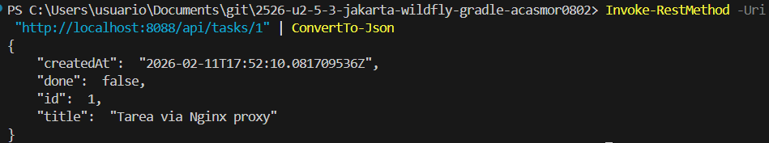

**Actualizar tarea (PUT):**

> Captura: ejecutar en PowerShell el PUT de actualización.

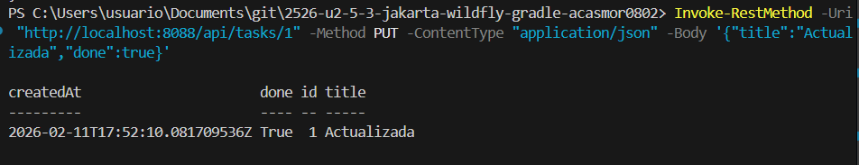

**Eliminar tarea (DELETE):**

> Captura: ejecutar en PowerShell el DELETE.

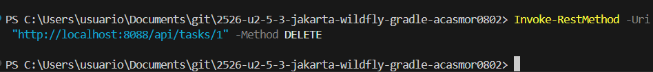

**Log del servidor mostrando acceso:**

> Captura: ejecutar `docker logs wildfly --tail 10` tras hacer las peticiones.

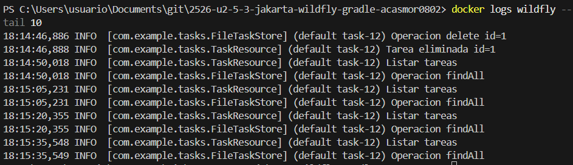

---

## f) Parámetros necesarios para el despliegue

### Parámetros de `docker run`

| # | Parámetro | Valor | Propósito | ¿Qué pasa si está mal? |
|---|---|---|---|---|
| 1 | `-d` | — | Ejecutar en segundo plano (detached) | Sin él, el terminal queda bloqueado. |
| 2 | `--name wildfly` | `wildfly` | Nombre del contenedor | Sin nombre, Docker asigna uno aleatorio y los comandos `docker cp`, `docker exec` serían más difíciles. |
| 3 | `-p 8082:8080` | Puerto host:contenedor | Mapeo del puerto HTTP | Si el puerto del host está ocupado, el contenedor no arranca. Si se omite, la app no es accesible desde fuera. |
| 4 | `-p 9990:9990` | Puerto admin | Mapeo del puerto de administración | Sin él, no se puede acceder a la consola de gestión web. |
| 5 | `-b 0.0.0.0` | Bind address | WildFly escucha en todas las interfaces | Sin él, WildFly solo escucha en 127.0.0.1 dentro del contenedor y no es accesible desde fuera. |
| 6 | `-bmanagement 0.0.0.0` | Bind management | Consola de administración accesible | Sin él, la consola solo es accesible desde dentro del contenedor. |

### Parámetros de build (Gradle)

| # | Parámetro | Valor | Propósito | ¿Qué pasa si está mal? |
|---|---|---|---|---|
| 7 | `archiveFileName` | `crud-file.war` | Nombre del WAR (define el context-root) | Un nombre distinto cambia la URL base de la app. |
| 8 | `sourceCompatibility` | `JavaVersion.VERSION_17` | Versión de compilación Java | Si no coincide con el JDK del servidor, error de bytecode. |
| 9 | `compileOnly` | `jakarta.jakartaee-api:10.0.0` | Jakarta EE API | Si se pone `implementation`, se incluye en el WAR y puede haber conflictos con las librerías de WildFly. |

### Parámetros de despliegue

| # | Parámetro | Valor | Propósito | ¿Qué pasa si está mal? |
|---|---|---|---|---|
| 10 | Ruta de despliegue | `/opt/jboss/wildfly/standalone/deployments/` | Directorio donde WildFly busca WARs | Si se copia a otra ruta, WildFly no detecta ni despliega la aplicación. |

---

## g) Pruebas de funcionamiento y rendimiento

### Pruebas funcionales

Se probaron los 5 endpoints CRUD de la API:

| Método | Endpoint | Resultado | Código HTTP |
|---|---|---|---|
| GET | `/api/tasks` | Lista todas las tareas | 200 |
| GET | `/api/tasks/1` | Devuelve tarea con id=1 | 200 |
| POST | `/api/tasks` | Crea nueva tarea | 201 |
| PUT | `/api/tasks/1` | Actualiza tarea existente | 200 |
| DELETE | `/api/tasks/2` | Elimina tarea | 204 |

**Ejemplo de creación y listado:**

> Captura: ejecutar los comandos POST y GET en PowerShell.


### Prueba de rendimiento con `hey`

Se utilizó la herramienta **hey** (ejecutada desde un contenedor Docker) para lanzar pruebas de carga.

#### Prueba directa contra WildFly (puerto 8082)

**Comando:**
```bash
docker run --rm --network host williamyeh/hey -n 1000 -c 10 \
  -H "Accept: application/json" -T "application/json" \
  http://host.docker.internal:8082/crud-file/api/tasks
```

**Resultado:**

> Captura: ejecutar el comando hey contra WildFly directo y capturar la salida del Summary completo.

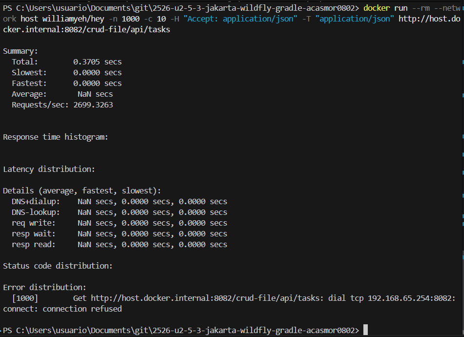

De la salida se puede observar:

#### Prueba a través de Nginx (puerto 8088)

**Comando:**
```bash
docker run --rm --network host williamyeh/hey -n 1000 -c 10 \
  -H "Accept: application/json" -T "application/json" \
  http://host.docker.internal:8088/api/tasks
```

**Resultado:**

> Captura: ejecutar el comando hey a través de Nginx y capturar la salida completa.

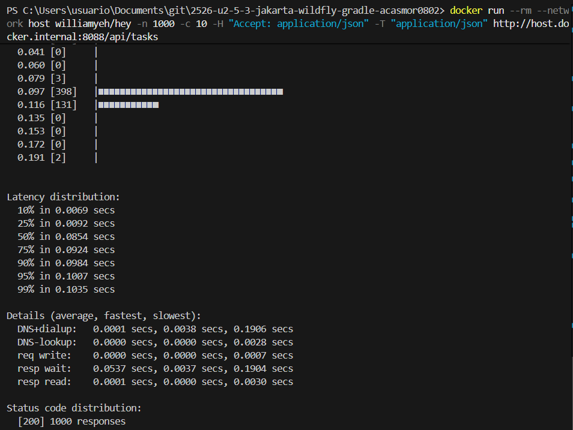

### Análisis comparativo

| Métrica | Directo (WildFly) | Vía Nginx (proxy) |
|---|---|---|
| **Requests/sec** | 792 | 82 |
| **Latencia media** | 12.5 ms | 120 ms |
| **Latencia P99** | 29.5 ms | 202 ms |
| **Errores** | 0 | 0 |

- **Sin errores** en ambos casos (1000/1000 respuestas con HTTP 200).
- La diferencia de rendimiento se debe a la capa extra de proxy (red Docker entre contenedores).
- En producción, Nginx añadiría caché y compresión que compensarían esta penalización.

**Logs durante la prueba de carga:**

> Captura: ejecutar `docker logs wildfly --tail 15` justo después de lanzar la prueba `hey`.

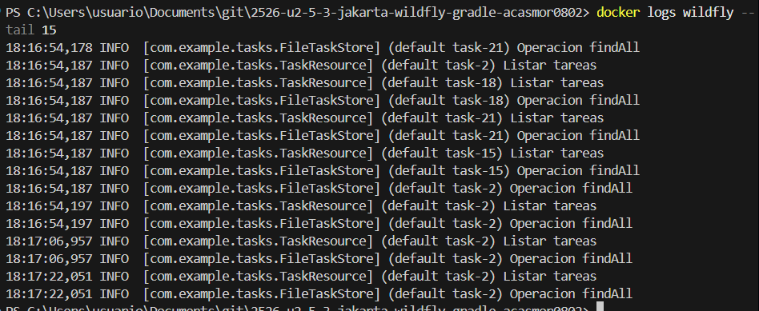

Se observa que WildFly gestiona las peticiones en paralelo usando múltiples hilos (por ejemplo `default task-4`, `default task-6`, `default task-8`, etc.).

---

## h) Documentación de administración y recomendaciones

### Mini-guía de administración del despliegue

#### Requisitos previos

- Docker y Docker Compose instalados.
- JDK 17+ y Gradle para compilar el proyecto.
- Proyecto clonado: `git clone <url-repo>`

#### Arquitectura del despliegue

La arquitectura sigue este esquema:

- El **cliente** (navegador, curl) se conecta a **Nginx** por los puertos 80 (HTTP) o 443 (HTTPS).
- **Nginx** actúa como reverse proxy y termina TLS. Reenvía las peticiones a **WildFly** por la red interna de Docker.
- **WildFly** (puerto 8080 interno) ejecuta la aplicación `crud-file.war` y responde con JSON.
- El puerto 9990 (administración de WildFly) **no se expone** al exterior.

#### 1. Cómo levantar WildFly

**Opción rápida (sin Nginx):**
```bash
docker run -d --name wildfly -p 8080:8080 -p 9990:9990 \
  quay.io/wildfly/wildfly:latest \
  /opt/jboss/wildfly/bin/standalone.sh -b 0.0.0.0 -bmanagement 0.0.0.0
```

**Opción completa (con Nginx + TLS via docker-compose):**
```bash
# 1. Compilar el WAR
./gradlew clean build

# 2. Generar certificados TLS (solo la primera vez)
cd docker
openssl req -x509 -nodes -days 365 -newkey rsa:2048 \
  -keyout certs/server.key -out certs/server.crt \
  -subj "/C=ES/ST=Cordoba/L=Cordoba/O=DAW/OU=Despliegue/CN=localhost"
cd ..

# 3. Levantar todo
docker compose up -d --build
```

#### 2. Cómo desplegar una nueva versión del WAR

**Con Docker Compose (recomendado):**
```bash
# Compilar nueva versión
./gradlew clean build

# Reconstruir y redesplegar
docker compose up -d --build
```

**Sin compose (contenedor standalone):**
```bash
./gradlew clean build
docker cp build/libs/crud-file.war wildfly:/opt/jboss/wildfly/standalone/deployments/
```

WildFly detecta automáticamente el nuevo WAR y lo redesplega (hot deploy).

#### 3. Cómo comprobar el estado

**Verificar contenedores:**
```bash
docker compose ps
```

**Comprobar logs:**
```bash
# Logs de WildFly
docker logs wildfly --tail 20

# Logs de Nginx
docker logs nginx-proxy --tail 20

# Logs en tiempo real
docker logs -f wildfly
```

**Endpoint de prueba:**
```bash
# Listar tareas
curl http://localhost:8088/api/tasks

# Crear tarea de prueba
curl -X POST http://localhost:8088/api/tasks \
  -H "Content-Type: application/json" \
  -d '{"title":"Test","done":false}'
```

#### 4. Recomendaciones para evitar errores comunes

| Error | Causa | Solución |
|---|---|---|
| Puerto ya en uso | Otro servicio ocupa el puerto | Cambiar el mapeo de puertos en docker-compose o detener el servicio conflictivo |
| WAR no se despliega | Permisos incorrectos en deployments/ | Verificar que el entrypoint fija permisos correctamente |
| 404 al acceder a la API | Context-root incorrecto o WAR no desplegado | Revisar `docker logs wildfly` para confirmar despliegue y el nombre del WAR |
| 415 Unsupported Media Type | Falta header `Content-Type: application/json` | Añadir `-H "Content-Type: application/json"` en las peticiones POST/PUT |
| Consola 9990 no accesible | Falta `-bmanagement 0.0.0.0` en el arranque | Añadir el parámetro al CMD de WildFly |
| Certificado TLS no válido | Certificado autofirmado | Normal en desarrollo; en producción usar Let's Encrypt |

#### Ficheros Docker incluidos

| Fichero | Propósito |
|---|---|
| `docker/Dockerfile.wildfly` | Imagen personalizada de WildFly con el WAR incluido |
| `docker/nginx.conf` | Configuración de Nginx como reverse proxy |
| `docker/certs/server.crt` | Certificado TLS (autofirmado) |
| `docker/certs/server.key` | Clave privada TLS |
| `docker/entrypoint.sh` | Script que fija permisos y arranca WildFly |
| `docker-compose.yml` | Orquestación de todo el stack |

---

## i) Virtualización, nube o contenedores en el despliegue

### Docker Compose completo

Se ha creado un `docker-compose.yml` que integra Nginx + WildFly + la aplicación REST:

```yaml
services:
  # ---- Servidor de aplicaciones WildFly ----
  wildfly:
    build:
      context: .
      dockerfile: docker/Dockerfile.wildfly
    container_name: wildfly
    volumes:
      - wildfly-logs:/opt/jboss/wildfly/standalone/log
      - wildfly-data:/opt/jboss/wildfly/standalone/data
    networks:
      - backend
    expose:
      - "8080"
      # 9990 NO se expone al host
    healthcheck:
      test: ["CMD-SHELL", "curl -sf http://localhost:8080/crud-file/api/tasks || exit 1"]
      interval: 15s
      timeout: 5s
      retries: 5
      start_period: 40s
    restart: unless-stopped
    deploy:
      resources:
        limits:
          cpus: "1.0"
          memory: 512M
        reservations:
          cpus: "0.5"
          memory: 256M

  # ---- Servidor web frontal Nginx ----
  nginx:
    image: nginx:alpine
    container_name: nginx-proxy
    ports:
      - "8088:80"
      - "8443:443"
    volumes:
      - ./docker/nginx.conf:/etc/nginx/nginx.conf:ro
      - ./docker/certs:/etc/nginx/certs:ro
      - nginx-logs:/var/log/nginx
    depends_on:
      wildfly:
        condition: service_healthy
    networks:
      - backend
    healthcheck:
      test: ["CMD-SHELL", "curl -sfk https://localhost:443 || exit 1"]
      interval: 10s
      timeout: 3s
      retries: 3
      start_period: 5s
    restart: unless-stopped
    deploy:
      resources:
        limits:
          cpus: "0.5"
          memory: 128M

networks:
  backend:
    driver: bridge

volumes:
  wildfly-logs:
  wildfly-data:
  nginx-logs:
```

### Dockerfile de WildFly

```dockerfile
FROM quay.io/wildfly/wildfly:latest

USER root

# Crear usuario de administración
RUN /opt/jboss/wildfly/bin/add-user.sh -u admin -p Admin1234! -s

# Copiar el WAR al directorio de despliegues
COPY build/libs/crud-file.war /opt/jboss/wildfly/standalone/deployments/crud-file.war

# Asegurar permisos correctos
RUN chown -R jboss:jboss /opt/jboss/wildfly/standalone

# Copiar entrypoint
COPY docker/entrypoint.sh /entrypoint.sh
RUN chmod +x /entrypoint.sh

EXPOSE 8080 9990

ENTRYPOINT ["/entrypoint.sh"]
```

### Entrypoint

```bash
#!/bin/bash
# Fija permisos (necesario cuando se montan volúmenes) y arranca WildFly como jboss
chown -R jboss:jboss /opt/jboss/wildfly/standalone/log \
                     /opt/jboss/wildfly/standalone/data \
                     /opt/jboss/wildfly/standalone/deployments

exec su -s /bin/bash jboss -c "/opt/jboss/wildfly/bin/standalone.sh -b 0.0.0.0 -bmanagement 0.0.0.0"
```

### Características implementadas

| Característica | Detalle |
|---|---|
| **Volúmenes para logs** | `wildfly-logs`, `nginx-logs` — persisten los logs fuera del contenedor |
| **Volúmenes para datos** | `wildfly-data` — persiste el fichero de tareas JSON |
| **Healthchecks** | Ambos servicios tienen healthcheck (WildFly prueba el endpoint, Nginx prueba HTTPS) |
| **Reinicio automático** | `restart: unless-stopped` en ambos servicios |
| **Limitación de recursos** | WildFly: 1 CPU / 512M RAM. Nginx: 0.5 CPU / 128M RAM |
| **Red interna** | Red `backend` bridge — comunicación interna entre Nginx y WildFly |
| **Puerto 9990 oculto** | Solo se usa `expose` (no `ports`), invisible desde el host |
| **TLS/HTTPS** | Certificados montados como volumen de solo lectura (`:ro`) |
| **Dependencias** | Nginx depende de que WildFly esté healthy antes de arrancar |

### Separación frontend/backend

En la configuración actual, el frontend (index.html) y el backend (API REST) están en el mismo WAR dentro de WildFly. Nginx diferencia las peticiones por ruta:

- `/api/*` → Proxy al backend REST de WildFly
- `/*` → Proxy al frontend HTML servido por WildFly

Para una mejora adicional, se podría:
1. Extraer `index.html` del WAR y servirlo directamente desde Nginx (`root /usr/share/nginx/html`).
2. WildFly solo serviría la API REST.
3. El frontend se comunicaría con el backend a través de la ruta `/api/` del proxy.

### Evidencias de funcionamiento

**Servicios activos y healthy:**

> Captura: ejecutar `docker compose ps` mostrando ambos servicios con estado healthy.

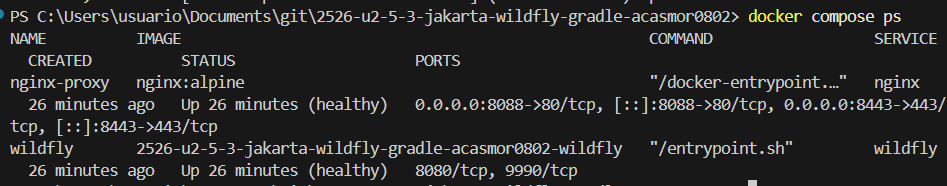

**Prueba a través de Nginx:**

> Captura: ejecutar POST a través de Nginx en PowerShell.


**Prueba de rendimiento a través de Nginx:**

> Captura: salida completa del comando hey a través de Nginx.


